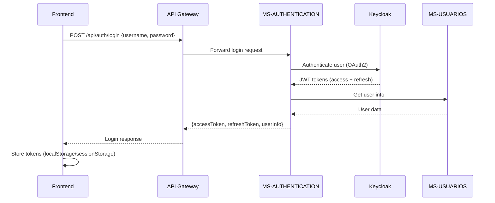

# Diseño - Documentación de Seguridad del Sistema JASS Digital

## 🎯 Objetivo 
Sistema integral para la gestión de servicios de agua potable y saneamiento en comunidades rurales, apoyando a las Juntas Administradoras de Servicios de Saneamiento.


## Estructura de la Documentación

### 1. Documento Principal: `SECURITY.md`

Documento único que contendrá toda la documentación de seguridad organizada en secciones:

```
SECURITY.md
├── 1. Introducción
├── 2. Arquitectura de Seguridad
│   ├── Diagrama de Arquitectura General
│   └── Descripción de Componentes
├── 3. Flujos de Autenticación
│   ├── Flujo de Login
│   ├── Flujo de Validación JWT
│   ├── Flujo de Refresh Token
│   └── Flujo de Cambio de Contraseña
├── 4. Análisis de Implementación
│   ├── Matriz de Features de Seguridad
│   └── Recomendaciones
├── 5. Configuración de Seguridad
│   ├── Keycloak
│   ├── JWT
│   ├── Spring Security
│   └── CORS
└── 6. Integración Frontend
    ├── Endpoints de API
    ├── Ejemplos de Código
    └── Manejo de Errores
```

## Arquitectura de Seguridad

### Componentes Principales

#### 1. Frontend (Aplicación Web)
- **Tecnología**: React/Angular/Vue (a determinar)
- **Responsabilidad**: Interfaz de usuario, almacenamiento de JWT, envío de tokens en requests
- **Puerto**: 3000 (desarrollo), 80/443 (producción)

#### 2. API Gateway (Opcional)
- **Tecnología**: Spring Cloud Gateway / Kong / Nginx
- **Responsabilidad**: Punto de entrada único, validación de JWT, enrutamiento
- **Puerto**: 8080

#### 3. MS-AUTHENTICATION
- **Tecnología**: Spring Boot WebFlux
- **Base de Datos**: MongoDB
- **Puerto**: 9092
- **Responsabilidad**: 
  - Integración con Keycloak
  - Gestión de usuarios
  - Login/Logout
  - Refresh tokens
  - Cambio de contraseñas

#### 4. Keycloak (IAM)
- **Tecnología**: Keycloak 25.0.6
- **Puerto**: 8180
- **Responsabilidad**:
  - Generación de JWT tokens
  - Gestión de usuarios y roles
  - Autenticación OAuth2
  - Validación de credenciales

#### 5. Microservicios con PostgreSQL (3)
- **MS-PAGOS-FACTURACION**: Gestión de pagos y facturación
- **MS-INFRAESTRUCTURA**: Control de infraestructura hídrica
- **MS-INVENTARIO-COMPRAS**: Gestión de inventarios y compras

#### 6. Microservicios con MongoDB (6)
- **MS-ORGANIZACIONES**: Gestión de organizaciones y JASS
- **MS-USUARIOS-AUTENTICACION**: Datos de usuarios (complementa Keycloak)
- **MS-DISTRIBUCION-AGUA**: Control de distribución de agua
- **MS-CALIDAD-AGUA**: Monitoreo de calidad del agua
- **MS-RECLAMOS-INCIDENCIAS**: Gestión de reclamos
- **MS-NOTIFICACIONES**: Sistema de notificaciones

### Flujo de Seguridad General

```
Frontend → API Gateway → MS-AUTHENTICATION → Keycloak
                ↓
         Microservicios (validación JWT)
```

## Diagramas a Incluir

### 1. Diagrama de Arquitectura General (Mermaid)

```mermaid
graph TB
    subgraph "Cliente"
        FE[Frontend Web]
    end
    
    subgraph "Capa de Seguridad"
        GW[API Gateway]
        AUTH[MS-AUTHENTICATION]
        KC[Keycloak]
    end
    
    subgraph "Microservicios PostgreSQL"
        MS1[MS-PAGOS-FACTURACION]
        MS2[MS-INFRAESTRUCTURA]
        MS3[MS-INVENTARIO-COMPRAS]
    end
    
    subgraph "Microservicios MongoDB"
        MS4[MS-ORGANIZACIONES]
        MS5[MS-USUARIOS]
        MS6[MS-DISTRIBUCION-AGUA]
        MS7[MS-CALIDAD-AGUA]
        MS8[MS-RECLAMOS]
        MS9[MS-NOTIFICACIONES]
    end
    
    subgraph "Bases de Datos"
        PG[(PostgreSQL)]
        MG[(MongoDB)]
    end
    
    FE -->|HTTPS| GW
    GW -->|Autenticación| AUTH
    AUTH -->|OAuth2| KC
    GW -->|JWT| MS1 & MS2 & MS3 & MS4 & MS5 & MS6 & MS7 & MS8 & MS9
    MS1 & MS2 & MS3 -->|SQL| PG
    MS4 & MS5 & MS6 & MS7 & MS8 & MS9 -->|NoSQL| MG
```


### 2. Diagrama de Secuencia - Login (Mermaid)


### 3. Diagrama de Secuencia - Validación JWT (Mermaid)

```mermaid
sequenceDiagram
    participant FE as Frontend
    participant GW as API Gateway
    participant MS as Microservicio
    participant KC as Keycloak
    
    FE->>GW: GET /api/resource<br/>Authorization: Bearer {JWT}
    GW->>GW: Validate JWT signature
    alt JWT válido
        GW->>MS: Forward request + JWT
        MS->>MS: Validate JWT (Spring Security)
        MS->>MS: Extract user info from JWT
        MS-->>GW: Resource data
        GW-->>FE: Response
    else JWT inválido/expirado
        GW-->>FE: 401 Unauthorized
    end
```


### 4. Diagrama de Secuencia - Refresh Token (Mermaid)

```mermaid
sequenceDiagram
    participant FE as Frontend
    participant GW as API Gateway
    participant AUTH as MS-AUTHENTICATION
    participant KC as Keycloak
    
    FE->>GW: POST /api/auth/refresh<br/>{refreshToken}
    GW->>AUTH: Forward refresh request
    AUTH->>KC: Refresh token (OAuth2)
    alt Refresh token válido
        KC-->>AUTH: New JWT tokens
        AUTH-->>GW: {accessToken, refreshToken}
        GW-->>FE: New tokens
        FE->>FE: Update stored tokens
    else Refresh token expirado
        AUTH-->>GW: 401 Unauthorized
        GW-->>FE: Session expired
        FE->>FE: Redirect to login
    end
```


### 5. Diagrama de Secuencia - Cambio de Contraseña (Mermaid)

```mermaid
sequenceDiagram
    participant FE as Frontend
    participant GW as API Gateway
    participant AUTH as MS-AUTHENTICATION
    participant KC as Keycloak
    
    FE->>GW: POST /api/auth/change-password<br/>{currentPassword, newPassword}
    GW->>AUTH: Forward request + JWT
    AUTH->>KC: Validate current password
    alt Contraseña actual correcta
        AUTH->>KC: Update password
        KC-->>AUTH: Success
        AUTH-->>GW: Password changed
        GW-->>FE: Success message
    else Contraseña actual incorrecta
        AUTH-->>GW: 400 Bad Request
        GW-->>FE: Error: Invalid current password
    end
```


## Análisis de Implementación

### Matriz de Features de Seguridad

| Feature | Estado | MS-AUTHENTICATION | Otros Microservicios | Notas |
|---------|--------|-------------------|----------------------|-------|
| Keycloak | ✅ Implementado | Sí | N/A | Configurado con realm sistema-jass |
| JWT | ✅ Implementado | Sí | Sí | OAuth2 Resource Server |
| Spring Security | ✅ Implementado | Sí | Sí | WebFlux Security |
| Validación JWT en Gateway | ❌ No implementado | N/A | N/A | No hay Gateway implementado |
| Refresh Tokens | ⚠️ Parcial | Parcial | N/A | Método existe pero incompleto |
| Expiración de Tokens | ✅ Implementado | Sí | N/A | 30 minutos configurado |
| Logout y Revocación | ❌ No implementado | No | N/A | Solo logout del lado cliente |
| MFA | ❌ No implementado | No | N/A | No configurado en Keycloak |
| Políticas de Contraseña | ✅ Implementado | Sí | N/A | 8+ caracteres, símbolos requeridos |
| Bloqueo de Cuenta | ❌ No implementado | No | N/A | Sin conteo de intentos fallidos |
| Recuperación con OTP | ❌ No implementado | No | N/A | Sin flujo de recuperación |
| Límite de Sesiones | ❌ No implementado | No | N/A | Sistema stateless sin control |

### Recomendaciones de Implementación

#### Prioridad Alta
1. **Implementar API Gateway** - Centralizar validación de JWT
2. **Completar Refresh Tokens** - Implementar con Keycloak REST API
3. **Logout con Revocación** - Implementar blacklist de tokens

#### Prioridad Media
4. **Bloqueo de Cuenta** - Implementar conteo de intentos fallidos
5. **Recuperación de Contraseña** - Implementar flujo con OTP

#### Prioridad Baja
6. **MFA** - Configurar en Keycloak (TOTP)
7. **Límite de Sesiones** - Implementar control de sesiones concurrentes

## Configuración de Seguridad

### Keycloak

#### Configuración del Realm
```yaml
Realm: sistema-jass
Display Name: Sistema JASS Digital
Enabled: true
Registration Allowed: false
Reset Password Allowed: true
Remember Me: true
Verify Email: false
Login With Email: true
```

#### Configuración de Tokens
```yaml
Access Token Lifespan: 1800 segundos (30 minutos)
Refresh Token Lifespan: 3600 segundos (60 minutos)
```

#### Roles del Sistema
- `SUPER_ADMIN`: Administrador del sistema
- `ADMIN`: Administrador de JASS
- `CLIENT`: Usuario cliente

#### Cliente OAuth2
```yaml
Client ID: jass-users-service
Client Secret: zJgI1QiNFXWiinFgAVfxsbqcF8nlGYLy
Access Type: confidential
Standard Flow Enabled: true
Direct Access Grants Enabled: true
```

### JWT Configuration

#### MS-AUTHENTICATION (application.yml)
```yaml
spring:
  security:
    oauth2:
      resourceserver:
        jwt:
          issuer-uri: https://lab.vallegrande.edu.pe/jass/keycloak/realms/sistema-jass
          jwk-set-uri: https://lab.vallegrande.edu.pe/jass/keycloak/realms/sistema-jass/protocol/openid-connect/certs

jwt:
  auth:
    converter:
      resource-id: jass-auth-service
      principle-attribute: preferred_username
```

#### Otros Microservicios (application.yml)
```yaml
spring:
  security:
    oauth2:
      resourceserver:
        jwt:
          issuer-uri: https://lab.vallegrande.edu.pe/jass/keycloak/realms/sistema-jass
          jwk-set-uri: https://lab.vallegrande.edu.pe/jass/keycloak/realms/sistema-jass/protocol/openid-connect/certs
```

### Spring Security

#### WebFlux (Reactive) - MS-AUTHENTICATION
```java
@Configuration
@EnableWebFluxSecurity
public class SecurityConfig {
    @Bean
    public SecurityWebFilterChain securityWebFilterChain(ServerHttpSecurity http) {
        return http
            .csrf(csrf -> csrf.disable())
            .authorizeExchange(exchanges -> exchanges
                .pathMatchers("/api/auth/login").permitAll()
                .pathMatchers("/api/auth/register").permitAll()
                .pathMatchers("/api/auth/refresh").permitAll()
                .pathMatchers("/actuator/**").permitAll()
                .pathMatchers("/swagger-ui/**").permitAll()
                .anyExchange().authenticated()
            )
            .oauth2ResourceServer(oauth2 -> oauth2.jwt(jwt -> {}))
            .build();
    }
}
```

#### MVC (Traditional) - Otros Microservicios
```java
@Configuration
@EnableWebSecurity
public class SecurityConfig {
    @Bean
    public SecurityFilterChain securityFilterChain(HttpSecurity http) throws Exception {
        return http
            .csrf(csrf -> csrf.disable())
            .authorizeHttpRequests(auth -> auth
                .requestMatchers("/actuator/**").permitAll()
                .requestMatchers("/swagger-ui/**").permitAll()
                .anyRequest().authenticated()
            )
            .oauth2ResourceServer(oauth2 -> oauth2.jwt(jwt -> {}))
            .build();
    }
}
```

### CORS Configuration

```yaml
cors:
  allowed-origins: "*"  # En producción: especificar dominios exactos
  allowed-methods: GET,POST,PUT,DELETE,PATCH,OPTIONS,HEAD
  allowed-headers: "*"
  allow-credentials: true
  max-age: 3600
```

## Integración Frontend

### Endpoints de API

#### Autenticación
```
POST /api/auth/login
POST /api/auth/logout
POST /api/auth/refresh
POST /api/auth/register
POST /api/auth/change-password
POST /api/auth/first-password-change
GET  /api/auth/validate
```

#### Request/Response Examples

**Login**
```javascript
// Request
POST /api/auth/login
{
  "username": "juan.perez@jass.gob.pe",
  "password": "MyPassword123!"
}

// Response
{
  "success": true,
  "message": "Login exitoso",
  "data": {
    "accessToken": "eyJhbGciOiJSUzI1NiIsInR5cCI6IkpXVCJ9...",
    "refreshToken": "eyJhbGciOiJIUzI1NiIsInR5cCI6IkpXVCJ9...",
    "tokenType": "Bearer",
    "expiresIn": 1800,
    "userInfo": {
      "userId": "507f1f77bcf86cd799439011",
      "username": "juan.perez@jass.gob.pe",
      "email": "juan.perez@example.com",
      "firstName": "Juan",
      "lastName": "Pérez",
      "organizationId": "507f1f77bcf86cd799439012",
      "roles": ["ADMIN"],
      "mustChangePassword": false
    }
  }
}
```

**Refresh Token**
```javascript
// Request
POST /api/auth/refresh
{
  "refreshToken": "eyJhbGciOiJIUzI1NiIsInR5cCI6IkpXVCJ9..."
}

// Response
{
  "success": true,
  "message": "Token refrescado",
  "data": {
    "accessToken": "eyJhbGciOiJSUzI1NiIsInR5cCI6IkpXVCJ9...",
    "refreshToken": "eyJhbGciOiJIUzI1NiIsInR5cCI6IkpXVCJ9...",
    "tokenType": "Bearer",
    "expiresIn": 1800
  }
}
```

### Ejemplos de Código Frontend

#### Almacenamiento de Tokens
```javascript
// Guardar tokens después del login
const saveTokens = (accessToken, refreshToken) => {
  localStorage.setItem('accessToken', accessToken);
  localStorage.setItem('refreshToken', refreshToken);
};

// Obtener token de acceso
const getAccessToken = () => {
  return localStorage.getItem('accessToken');
};

// Limpiar tokens al logout
const clearTokens = () => {
  localStorage.removeItem('accessToken');
  localStorage.removeItem('refreshToken');
};
```

#### Incluir JWT en Requests
```javascript
// Axios interceptor
axios.interceptors.request.use(
  (config) => {
    const token = getAccessToken();
    if (token) {
      config.headers.Authorization = `Bearer ${token}`;
    }
    return config;
  },
  (error) => Promise.reject(error)
);
```

#### Manejo de Token Expirado con Refresh
```javascript
// Axios response interceptor
axios.interceptors.response.use(
  (response) => response,
  async (error) => {
    const originalRequest = error.config;
    
    // Si el token expiró y no hemos intentado refrescar
    if (error.response?.status === 401 && !originalRequest._retry) {
      originalRequest._retry = true;
      
      try {
        const refreshToken = localStorage.getItem('refreshToken');
        const response = await axios.post('/api/auth/refresh', { refreshToken });
        
        const { accessToken, refreshToken: newRefreshToken } = response.data.data;
        saveTokens(accessToken, newRefreshToken);
        
        // Reintentar request original con nuevo token
        originalRequest.headers.Authorization = `Bearer ${accessToken}`;
        return axios(originalRequest);
      } catch (refreshError) {
        // Refresh falló, redirigir a login
        clearTokens();
        window.location.href = '/login';
        return Promise.reject(refreshError);
      }
    }
    
    return Promise.reject(error);
  }
);
```

### Manejo de Errores

#### Códigos de Error Comunes
```javascript
const handleAuthError = (error) => {
  switch (error.response?.status) {
    case 401:
      // Token inválido o expirado
      clearTokens();
      window.location.href = '/login';
      break;
    case 403:
      // Sin permisos
      showError('No tienes permisos para realizar esta acción');
      break;
    case 400:
      // Credenciales inválidas
      showError('Usuario o contraseña incorrectos');
      break;
    default:
      showError('Error de autenticación');
  }
};
```

## Tecnologías Utilizadas

- **Backend**: Spring Boot 3.5.5, Spring WebFlux, Spring Security
- **Autenticación**: Keycloak 25.0.6, OAuth2, JWT
- **Bases de Datos**: PostgreSQL, MongoDB
- **Documentación**: OpenAPI 3.0 (Swagger)
- **Diagramas**: Mermaid

## Consideraciones de Seguridad

### Buenas Prácticas Implementadas
- ✅ Tokens JWT con expiración corta (30 min)
- ✅ Refresh tokens para renovación
- ✅ Políticas de contraseña fuertes
- ✅ HTTPS/TLS en producción
- ✅ CORS configurado
- ✅ Endpoints públicos mínimos

### Mejoras Recomendadas
- ⚠️ Implementar API Gateway para validación centralizada
- ⚠️ Agregar MFA (Multi-Factor Authentication)
- ⚠️ Implementar blacklist de tokens para logout
- ⚠️ Agregar rate limiting para prevenir ataques de fuerza bruta
- ⚠️ Implementar auditoría de accesos
- ⚠️ Configurar sesiones concurrentes limitadas
