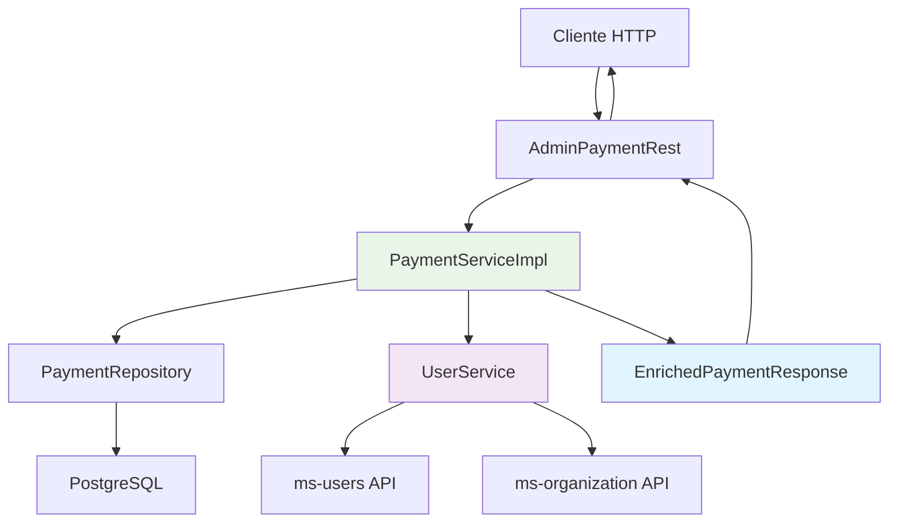

# 💰 Microservicio de Pagos y Recibos - Sistema JASS Digital

<div align="center">


[]()
[]()
[]()

</div>

## 📋 Descripción General

Microservicio reactivo para la gestión integral de **pagos, detalles de pago y emisión de recibos** del Sistema JASS Digital. Implementa arquitectura hexagonal con Spring Boot WebFlux para alta concurrencia y rendimiento optimizado.

### 🎯 Funcionalidades Principales

- ✅ **Gestión de Pagos**: Registro, actualización y consulta de pagos
- ✅ **Detalles de Pago**: Manejo de conceptos múltiples por pago
- ✅ **Pagos Enriquecidos**: Información completa con datos de usuario y organización
- ✅ **Recibos Electrónicos**: Generación automática de comprobantes
- ✅ **API Reactiva**: Endpoints no bloqueantes con WebFlux
- ✅ **Arquitectura Hexagonal**: Separación clara de responsabilidades
- ✅ **Integración con Microservicios**: Comunicación con ms-users y ms-organization
- ✅ **Manejo Robusto de Errores**: Fallbacks y recuperación automática

---

## 🚀 Nuevas Mejoras Implementadas (v2.0.0)

### 🔥 Endpoints de Pagos Enriquecidos
- **`GET /api/admin/payments/enriched`** - Lista pagos con información completa de usuario y organización
- **`GET /api/admin/payments/{id}/enriched`** - Obtiene un pago específico con datos enriquecidos
- Incluye información del usuario (nombre, documento, email, teléfono, dirección)
- Incluye información de la organización (nombre, logo)
- Incluye información de asignación de caja de agua (código de caja, ID)

### ⚡ Optimización de Servicios Externos
- **UserService mejorado**: Método unificado `getUserByIdAutoAuth(userId, organizationId)`
- **Manejo inteligente de errores**: Fallbacks automáticos con datos por defecto
- **Eliminación de métodos redundantes**: Código más limpio y mantenible
- **Logging mejorado**: Trazabilidad completa de operaciones

### 🛡️ Robustez y Confiabilidad
- **Recuperación automática de errores**: Si falla la obtención de datos externos, continúa con valores por defecto
- **Validación mejorada**: Verificación de datos antes de procesamiento
- **Transacciones optimizadas**: Mejor manejo de operaciones en cascada

---

## 🏗️ Stack Tecnológico

### Backend Core
- **☕ Java 17** - Lenguaje de programación
- **🍃 Spring Boot 3.5.0** - Framework principal
- **⚡ Spring WebFlux** - Programación reactiva
- **🔄 R2DBC** - Acceso reactivo a base de datos
- **📊 PostgreSQL** - Base de datos relacional

### Herramientas y Librerías
- **🔧 Lombok** - Reducción de código boilerplate
- **📝 SpringDoc OpenAPI** - Documentación automática
- **📈 Micrometer + Prometheus** - Métricas y monitoreo
- **🏥 Spring Actuator** - Health checks y endpoints de gestión
- **✅ Bean Validation** - Validación de datos

### DevOps y Despliegue
- **🐳 Docker** - Containerización
- **📦 Maven** - Gestión de dependencias
- **🔍 Swagger UI** - Interfaz de documentación API

---

## 🏛️ Arquitectura del Sistema

### Arquitectura Hexagonal (Ports & Adapters)

```
📁 vg_ms_payment/
├── 🎯 domain/                    # Capa de Dominio (Core Business)
│   ├── models/                   # Entidades de negocio
│   │   ├── Payment.java          # Entidad principal de pago
│   │   ├── PaymentDetail.java    # Detalles del pago
│   │   └── Receipts.java         # Recibos generados
│   └── enums/                    # Constantes y enumeraciones
│       └── Constants.java        # Constantes del sistema
├── ⚙️ application/               # Capa de Aplicación (Casos de Uso)
│   └── services/                 # Servicios de aplicación
│       ├── PaymentService.java   # Interface del servicio
│       └── impl/                 # Implementaciones
│           └── PaymentServiceImpl.java # Lógica de negocio
└── 🔧 infrastructure/            # Capa de Infraestructura
    ├── entity/                   # Entidades PostgreSQL
    │   ├── BaseEntity.java       # Entidad base
    │   ├── PaymentEntity.java    # Entidad de pago
    │   └── PaymentDetailEntity.java # Entidad de detalle
    ├── repository/               # Repositorios R2DBC
    │   ├── PaymentRepository.java
    │   └── PaymentDetailRepository.java
    ├── rest/                     # Controladores REST
    │   ├── admin/                # Endpoints administrativos
    │   │   └── AdminPaymentRest.java # CRUD completo + enriquecidos
    │   └── client/               # Endpoints públicos
    │       └── PaymentRest.java  # Consultas públicas
    ├── dto/                      # Data Transfer Objects
    │   ├── request/              # DTOs de entrada
    │   │   └── PaymentCreateRequest.java
    │   ├── response/             # DTOs de salida
    │   │   ├── PaymentResponse.java
    │   │   ├── PaymentDResponse.java
    │   │   └── EnrichedPaymentResponse.java # 🆕 Respuesta enriquecida
    │   └── common/               # DTOs comunes
    │       ├── ResponseDto.java
    │       └── ErrorMessage.java
    ├── mapper/                   # Mappers entre capas
    │   ├── BaseMapper.java
    │   ├── PaymentMapper.java
    │   ├── PaymentDetailMapper.java
    │   └── PaymentDtoMapper.java
    ├── config/                   # Configuraciones
    │   └── WebClientConfig.java  # Configuración de clientes HTTP
    ├── exception/                # Manejo de excepciones
    │   └── GlobalExceptionHandler.java
    └── service/                  # Servicios de infraestructura
        └── UserService.java      # 🆕 Servicio mejorado para usuarios
```

### Flujo de Datos Enriquecidos



---

## 🗄️ Modelo de Datos

### Entidades Principales

#### 💳 Payments
```sql
CREATE TABLE IF NOT EXISTS payments (
    payment_id VARCHAR(100) PRIMARY KEY,
    organization_id VARCHAR(50) NOT NULL,
    payment_code VARCHAR(20) UNIQUE,
    user_id VARCHAR(50) NOT NULL,
    water_box_id VARCHAR(50),
    payment_type VARCHAR(20),           -- SERVICIO_AGUA, REPOSICION_CAJA, MIXTO
    payment_method VARCHAR(20),         -- EFECTIVO, YAPE, PLIN, TRANSFERENCIA
    total_amount DECIMAL(10,2) NOT NULL,
    payment_date DATE NOT NULL,
    payment_status VARCHAR(20),         -- PENDING, PAID, CANCELLED
    external_reference VARCHAR(100),
    created_at TIMESTAMP DEFAULT NOW(),
    updated_at TIMESTAMP DEFAULT NOW()
);
```

#### 📋 Payment Details
```sql
CREATE TABLE IF NOT EXISTS payment_details (
    payment_detail_id VARCHAR(100) PRIMARY KEY,
    payment_id VARCHAR(50),
    concept VARCHAR(50),
    year INTEGER,
    month INTEGER,
    amount DECIMAL(10,2),
    description TEXT,
    period_start DATE,
    period_end DATE,
    FOREIGN KEY (payment_id) REFERENCES payments(payment_id) ON DELETE CASCADE
);
```

#### 🧾 Receipts
```sql
CREATE TABLE IF NOT EXISTS receipts (
    receipts_id VARCHAR(100) PRIMARY KEY,
    organization_id VARCHAR(50),
    payment_id VARCHAR(50),
    payment_detail_id VARCHAR(50),
    receipt_series VARCHAR(20),
    receipt_number VARCHAR(20),
    receipt_type VARCHAR(30),
    issue_date TIMESTAMP,
    amount DECIMAL(10,2),
    year INTEGER,
    month INTEGER,
    concept TEXT,
    customer_full_name VARCHAR(200),
    customer_document VARCHAR(30),
    pdf_generated BOOLEAN DEFAULT FALSE,
    pdf_path VARCHAR(500),
    created_at TIMESTAMP,
    FOREIGN KEY (payment_id) REFERENCES payments(payment_id) ON DELETE CASCADE,
    FOREIGN KEY (payment_detail_id) REFERENCES payment_details(payment_detail_id) ON DELETE CASCADE
);
```

### Relaciones y Índices
- 🔗 **1:N** - Un pago puede tener múltiples detalles
- 🔗 **1:N** - Un pago puede generar múltiples recibos
- 🔗 **N:1** - Múltiples pagos pertenecen a una organización
- 🔗 **N:1** - Múltiples pagos pertenecen a un usuario
- 📊 **Índices optimizados** para consultas por organización, usuario, fecha y estado

---

## 🚀 API Endpoints

### 👨‍💼 Endpoints Administrativos (`/api/admin`)

| Método | Endpoint | Descripción | Respuesta | Auth |
|--------|----------|-------------|-----------|------|
| `GET` | `/api/admin/payments/enriched` | 🆕 Listar pagos con información enriquecida | `EnrichedPaymentResponse[]` | ✅ |
| `GET` | `/api/admin/payments/{id}/enriched` | 🆕 Obtener pago enriquecido por ID | `EnrichedPaymentResponse` | ✅ |
| `POST` | `/api/admin/payments` | Crear nuevo pago | `PaymentResponse` | ✅ |
| `PUT` | `/api/admin/payments/{id}` | Actualizar pago existente | `PaymentResponse` | ✅ |
| `DELETE` | `/api/admin/payments/{id}` | Eliminar pago específico | `void` | ✅ |
| `DELETE` | `/api/admin/payments` | Eliminar todos los pagos | `void` | ✅ |

### 👥 Endpoints Públicos (`/api/client`)

| Método | Endpoint | Descripción | Respuesta | Auth |
|--------|----------|-------------|-----------|------|
| `GET` | `/api/client/payments` | Listar pagos públicos | `PaymentResponse[]` | ❌ |
| `GET` | `/api/client/payments/{id}` | Obtener pago por ID | `PaymentResponse` | ❌ |

### 📊 Endpoints de Monitoreo

| Método | Endpoint | Descripción |
|--------|----------|-------------|
| `GET` | `/actuator/health` | Estado de salud del servicio |
| `GET` | `/actuator/info` | Información del servicio |
| `GET` | `/swagger-ui.html` | Documentación interactiva |

---

## 📝 Ejemplos de Uso

### 🆕 Obtener Pago Enriquecido

**Request:**
```http
GET /api/admin/payments/pay-uuid-123/enriched
Accept: application/json
```

**Response:**
```json
{
  "success": true,
  "data": {
    "paymentId": "pay-uuid-123",
    "organizationId": "org-123",
    "organizationName": "JASS San Juan de Miraflores",
    "organizationLogo": "data:image/png;base64,iVBORw0KGgoAAAANSUhEUgAA...",
    "paymentCode": "PAG-2024-001",
    "userId": "user-456",
    "userName": "Juan Pérez García",
    "firstName": "Juan",
    "lastName": "Pérez García",
    "userDocument": "12345678",
    "email": "juan.perez@email.com",
    "phone": "+51987654321",
    "userAddress": "Av. Principal 123, San Juan de Miraflores",
    "waterBoxId": "box-789",
    "assignedWaterBoxId": 789,
    "boxCode": "CAJA-001",
    "paymentType": "SERVICIO_AGUA",
    "paymentMethod": "YAPE",
    "totalAmount": 85.50,
    "paymentDate": "2024-01-15",
    "paymentStatus": "PAID",
    "externalReference": "YAPE-789456123",
    "createdAt": "2024-01-15T10:30:00Z",
    "updatedAt": "2024-01-15T10:30:00Z",
    "details": [
      {
        "detailId": "detail-uuid-1",
        "paymentId": "pay-uuid-123",
        "concept": "SERVICIO_AGUA_ENERO",
        "amount": 45.50,
        "year": 2024,
        "month": 1,
        "description": "Servicio de agua potable - Enero 2024",
        "periodStart": "2024-01-01",
        "periodEnd": "2024-01-31"
      },
      {
        "detailId": "detail-uuid-2",
        "paymentId": "pay-uuid-123",
        "concept": "MANTENIMIENTO",
        "amount": 40.00,
        "year": 2024,
        "month": 1,
        "description": "Mantenimiento de infraestructura"
      }
    ]
  }
}
```

### Crear un Nuevo Pago

**Request:**
```http
POST /api/admin/payments
Content-Type: application/json

{
  "organizationId": "org-123",
  "paymentCode": "PAG-2024-001",
  "userId": "user-456",
  "waterBoxId": "box-789",
  "paymentType": "SERVICIO_AGUA",
  "paymentMethod": "YAPE",
  "totalAmount": 85.50,
  "paymentDate": "2024-01-15",
  "paymentStatus": "PAID",
  "externalReference": "YAPE-789456123",
  "details": [
    {
      "concept": "SERVICIO_AGUA_ENERO",
      "amount": 45.50,
      "year": 2024,
      "month": 1,
      "description": "Servicio de agua potable - Enero 2024",
      "periodStart": "2024-01-01",
      "periodEnd": "2024-01-31"
    },
    {
      "concept": "MANTENIMIENTO",
      "amount": 40.00,
      "year": 2024,
      "month": 1,
      "description": "Mantenimiento de infraestructura"
    }
  ]
}
```

**Response:**
```json
{
  "success": true,
  "data": {
    "paymentId": "pay-uuid-123",
    "organizationId": "org-123",
    "paymentCode": "PAG-2024-001",
    "userId": "user-456",
    "waterBoxId": "box-789",
    "paymentType": "SERVICIO_AGUA",
    "paymentMethod": "YAPE",
    "totalAmount": 85.50,
    "paymentDate": "2024-01-15",
    "paymentStatus": "PAID",
    "externalReference": "YAPE-789456123",
    "createdAt": "2024-01-15T10:30:00Z",
    "updatedAt": "2024-01-15T10:30:00Z",
    "details": [
      {
        "detailId": "detail-uuid-1",
        "paymentId": "pay-uuid-123",
        "concept": "SERVICIO_AGUA_ENERO",
        "amount": 45.50,
        "year": 2024,
        "month": 1,
        "description": "Servicio de agua potable - Enero 2024",
        "periodStart": "2024-01-01",
        "periodEnd": "2024-01-31"
      }
    ]
  }
}
```

---

## ⚙️ Configuración y Despliegue

### Variables de Entorno

| Variable | Descripción | Valor por Defecto |
|----------|-------------|-------------------|
| `NOMBRE_MICROSERVICIO` | Nombre del microservicio | `vg_ms_payment` |
| `SERVER_PORT` | Puerto del servidor | `8083` |
| `SPRING_R2DBC_URL` | URL de conexión PostgreSQL | - |
| `SPRING_R2DBC_USERNAME` | Usuario de base de datos | - |
| `SPRING_R2DBC_PASSWORD` | Contraseña de base de datos | - |
| `SPRING_PROFILES_ACTIVE` | Perfil activo | `dev` |

### Configuración de Microservicios Externos

```yaml
microservices:
  users:
    name: ms-users
    url: https://lab.vallegrande.edu.pe/jass/ms-users/internal
    timeout: 5000
  organization:
    name: ms-organization
    url: https://lab.vallegrande.edu.pe/jass/ms-organization/api/management
    timeout: 5000
  infrastructure:
    name: ms-infraestructura
    url: https://lab.vallegrande.edu.pe/jass/ms-infraestructura
    timeout: 5000
```

### Perfiles de Configuración

#### 🔧 Desarrollo (`application-dev.yml`)
```yaml
spring:
  r2dbc:
    url: r2dbc:postgresql://localhost:5432/payment_dev
    username: postgres
    password: password
    pool:
      initial-size: 5
      max-size: 20

logging:
  level:
    pe.edu.vallegrande.vg_ms_payment: DEBUG
```

#### 🚀 Producción (`application-prod.yml`)
```yaml
spring:
  r2dbc:
    url: ${SPRING_R2DBC_URL}
    username: ${SPRING_R2DBC_USERNAME}
    password: ${SPRING_R2DBC_PASSWORD}
    pool:
      initial-size: 2
      max-size: 8
      max-idle-time: 15m

logging:
  level:
    pe.edu.vallegrande.vg_ms_payment: INFO
```

---

## 🐳 Docker y Despliegue

### Dockerfile Multi-stage
```dockerfile
FROM openjdk:17-jdk-slim as builder
WORKDIR /app
COPY . .
RUN ./mvnw clean package -DskipTests

FROM openjdk:17-jre-slim
WORKDIR /app
COPY --from=builder /app/target/*.jar app.jar
EXPOSE 8083
ENTRYPOINT ["java", "-jar", "app.jar"]
```

### Docker Compose
```yaml
version: '3.8'
services:
  vg-ms-payments:
    build: .
    container_name: vg-ms-payments
    ports:
      - "8083:8083"
    environment:
      - SPRING_PROFILES_ACTIVE=prod
      - SPRING_R2DBC_URL=r2dbc:postgresql://db:5432/payments
    depends_on:
      - db
    deploy:
      resources:
        limits:
          memory: 512M
          cpus: '0.5'
    healthcheck:
      test: ["CMD", "curl", "-f", "http://localhost:8083/actuator/health"]
      interval: 30s
      timeout: 10s
      retries: 3
```

### Comandos de Despliegue

```bash
# Desarrollo local
./mvnw spring-boot:run -Dspring-boot.run.profiles=dev

# Construcción
./mvnw clean package -DskipTests

# Docker
docker build -t vg-ms-payments .
docker run -p 8083:8083 vg-ms-payments

# Docker Compose
docker-compose up --build -d
```

---

## 🔍 Monitoreo y Observabilidad

### Health Checks
```bash
# Estado general
curl http://localhost:8083/actuator/health

# Información del servicio
curl http://localhost:8083/actuator/info
```

### Métricas y Logging

#### Configuración de Métricas
```yaml
management:
  endpoints:
    web:
      exposure:
        include: health,info
  endpoint:
    health:
      show-details: when-authorized
      cache:
        time-to-live: 10s
```

#### Logs Estructurados
```json
{
  "timestamp": "2024-01-15T10:30:00.000Z",
  "level": "INFO",
  "logger": "pe.edu.vallegrande.vg_ms_payment.application.services.impl.PaymentServiceImpl",
  "message": "enriched payment retrieved by id: pay-uuid-123",
  "paymentId": "pay-uuid-123",
  "organizationId": "org-123",
  "userId": "user-456"
}
```

---

## 🧪 Testing

### Ejecutar Tests
```bash
# Tests unitarios
./mvnw test

# Tests de integración
./mvnw verify

# Coverage report
./mvnw jacoco:report
```

### Estructura de Tests
```
src/test/java/
├── unit/                    # Tests unitarios
│   ├── domain/             # Tests de dominio
│   ├── application/        # Tests de servicios
│   └── infrastructure/     # Tests de infraestructura
└── integration/            # Tests de integración
    ├── repository/         # Tests de repositorio
    └── rest/              # Tests de controladores
```

---

## 🔗 Integración con Microservicios

### Servicios Externos

#### 👥 ms-users
- **URL**: `https://lab.vallegrande.edu.pe/jass/ms-users/internal`
- **Función**: Obtener información completa de usuarios
- **Endpoint**: `/clients/{userId}?organizationId={organizationId}`
- **Timeout**: 5000ms
- **Fallback**: Usuario con datos "N/A" si falla

#### 🏢 ms-organization
- **URL**: `https://lab.vallegrande.edu.pe/jass/ms-organization/api/management`
- **Función**: Obtener información de organizaciones y logos
- **Endpoint**: `/organizations/{organizationId}`
- **Timeout**: 5000ms
- **Fallback**: Organización con nombre "N/A" si falla

### Manejo de Errores en Integraciones

```java
// Ejemplo de manejo robusto de errores
Mono<UserService.UserResponse> userMono = userService.getUserByIdAutoAuth(userId, organizationId)
    .onErrorResume(error -> {
        log.warn("No se pudo obtener información del usuario: {}", error.getMessage());
        UserService.UserResponse emptyUser = new UserService.UserResponse();
        emptyUser.setFirstName("N/A");
        emptyUser.setLastName("N/A");
        return Mono.just(emptyUser);
    });
```

---

## 📚 Documentación Adicional

### Swagger UI
- **URL**: `http://localhost:8083/swagger-ui.html`
- **Descripción**: Documentación interactiva de la API
- **Características**: 
  - Pruebas en vivo de endpoints
  - Esquemas de request/response
  - Ejemplos de uso

### OpenAPI Spec
- **URL**: `http://localhost:8083/v3/api-docs`
- **Formato**: JSON/YAML
- **Uso**: Generación de clientes automáticos

### Postman Collection
Importa la colección desde: `src/main/resources/doc/payment-collection.json`

---

## 🚀 Roadmap

### Versión 2.1.0 (Próxima)
- [ ] 📄 Generación automática de PDFs para recibos
- [ ] 🔔 Sistema de notificaciones push
- [ ] 📊 Dashboard de métricas en tiempo real
- [ ] 🔄 Cache distribuido con Redis

### Versión 2.2.0 (Futuro)
- [ ] 💳 Integración con pasarelas de pago
- [ ] 🌐 API GraphQL
- [ ] 💱 Soporte para múltiples monedas
- [ ] 📱 SDK para aplicaciones móviles

### Versión 2.3.0 (Largo Plazo)
- [ ] 🤖 IA para detección de fraudes
- [ ] 🔐 Autenticación biométrica
- [ ] 🌍 Soporte multi-idioma
- [ ] 📈 Analytics avanzados

---

## 🤝 Contribución

### Guías de Desarrollo
1. **Fork** el repositorio
2. **Crea** una rama feature (`git checkout -b feature/nueva-funcionalidad`)
3. **Commit** tus cambios (`git commit -am 'Agrega nueva funcionalidad'`)
4. **Push** a la rama (`git push origin feature/nueva-funcionalidad`)
5. **Crea** un Pull Request

### Estándares de Código
- ✅ Seguir convenciones de Java y Spring Boot
- ✅ Cobertura de tests > 80%
- ✅ Documentación de métodos públicos
- ✅ Validación de entrada en todos los endpoints
- ✅ Manejo robusto de errores con fallbacks
- ✅ Logging estructurado para trazabilidad

### Checklist de Pull Request
- [ ] Tests unitarios agregados/actualizados
- [ ] Documentación actualizada
- [ ] Swagger/OpenAPI actualizado
- [ ] Logs apropiados agregados
- [ ] Manejo de errores implementado
- [ ] Performance considerado

---

## 📄 Licencia

Este proyecto está bajo la Licencia MIT - ver el archivo [LICENSE](LICENSE) para más detalles.

---

## 👥 Equipo de Desarrollo

<div align="center">

**🏢 Valle Grande - Área de Innovación y Tecnología**

[](https://vallegrande.edu.pe)

**Desarrollado con ❤️ para el Sistema JASS Digital**

</div>

---

## 📞 Soporte

- 📧 **Email**: soporte@vallegrande.edu.pe
- 🌐 **Web**: https://vallegrande.edu.pe
- 📱 **Slack**: #jass-digital-support
- 📋 **Issues**: [GitHub Issues](https://github.com/vallegrande/vg-ms-payments/issues)

---

## 📊 Métricas del Proyecto

<div align="center">


**⭐ Si este proyecto te fue útil, no olvides darle una estrella ⭐**

</div>

---

## 🔄 Changelog

### v2.0.0 (Actual)
- ✅ Implementación de endpoints enriquecidos
- ✅ Optimización del UserService
- ✅ Mejora en manejo de errores
- ✅ Documentación completa actualizada
- ✅ Fallbacks automáticos para servicios externos

### v1.0.0 (Anterior)
- ✅ CRUD básico de pagos
- ✅ Gestión de detalles de pago
- ✅ Integración básica con microservicios
- ✅ API reactiva con WebFlux